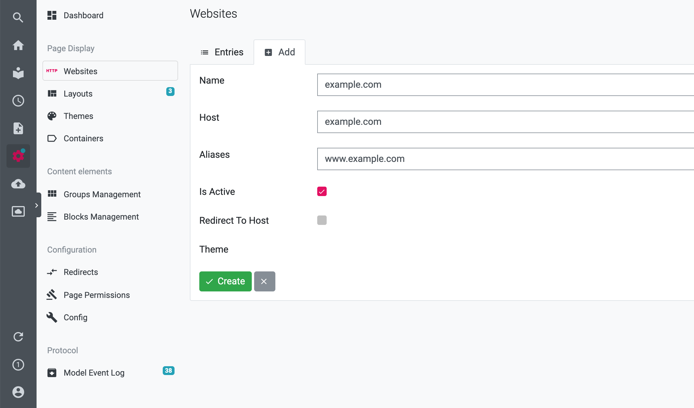
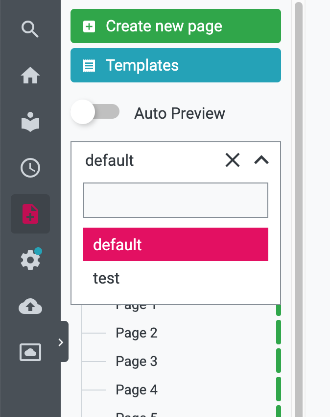

# Multiple Websites

Since LUYA CMS version 4.0 it is possible to manage multiple website in one LUYA instance. 

## Add a new website

Under CMS settings > Websites you can manage your websites. There is always a default website which will used a fallback if no other website/host matched. 
Every website have to have a name and a host/domain. You can also have different themes for each website.

## Website's content

To manage the CMS pages for a website you can easily select it in the dropdown above the pages and containers:

